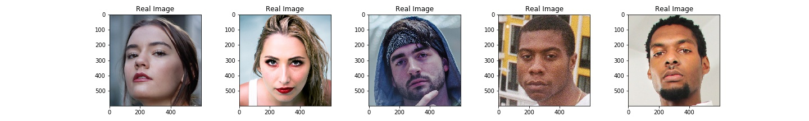

# An-Extended-InceptionV3-Network-for-Real-and-Fake-Face-Detection
This repository contains an extended version of the keras pre-trained InceptionV3 CNN to help identify real, from fake face images.

This model is trained on the "Real and Fake Face Detection" dataset provided by <a href="https://www.kaggle.com/ciplab/real-and-fake-face-detection">Kaggle</a> .   

<h3>About The Dataset</h2> 
This dataset contains a total of 2041 high quality images, with a total of 2041 images of people (1081 real images of people, and 960 fake/photoshopped images of people). The fake/photoshopped images were split into 3 categories, easy, medium, and hard depending upon the difficulty level for say, a human to ditinguish it from a real image.  

<h3>Visualising The Dataset</h3>
Some of the images containing real images of people look like :  

Some of the images containing fake/photoshopped images of people look like :  

<h3>About The InceptionV3 Network</h3> 
More about this CNN can be found in this <a href="https://www.cv-foundation.org/openaccess/content_cvpr_2016/papers/Szegedy_Rethinking_the_Inception_CVPR_2016_paper.pdf">paper</a>.  
The original InceptionV3 network as taken from keras looks like <a href="https://images.app.goo.gl/VsCRQEa9qL7HZSoD8">(source)</a>: 
 
But the extended version of this network used in this project looks like :  
    

The intuition for how to handle directories, and split the images into training and test sets comes from these <a href="https://www.kaggle.com/martin1234567890/real-vs-fake-face">two</a> <a href="https://www.kaggle.com/anastasia484/face-anti-spoofing">Kernels</a> respectively.
